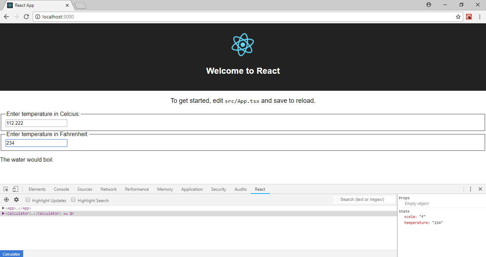

# React - Lifting State Up in Typescript

This repository contains the Typescript code of Lifting State Up sample given in the official website of React documentation [React - Lifting State Up](https://reactjs.org/docs/lifting-state-up.html)

This is code is only meant to give you a quick headstart when working with Typescript in React.

Before starting, I assume that you're already using [Node.js](https://nodejs.org/) with [npm](https://www.npmjs.com/).

To get started, install create-react-app

```shell
npm install -g create-react-app
```

Create a new project

```shell
create-react-app lifting-state-up-ts --scripts-version=react-scripts-ts
```

Once project is created, you can start by editing the index.html file in public folder.
Add a new div after the root div.

```shell
    <div id="root"></div>
    <!--
      This HTML file is a template.
      If you open it directly in the browser, you will see an empty page.

      You can add webfonts, meta tags, or analytics to this file.
      The build step will place the bundled scripts into the <body> tag.

      To begin the development, run `npm start` or `yarn start`.
      To create a production bundle, use `npm run build` or `yarn build`.
    -->

    <!-- Calculator Div -->
    <div id="calcdiv"></div>
```

Now start adding up the BoilingVerdict.tsx, TemperatureInput.tsx and Calculator.tsx files in the src folder.

React js uses props and state to do its work. In javascript, props and state do not have any datatype whereas in Typescript, everything needs a datatype. So you create interfaces for props and state.
Here I created ITemperatureProp and ITemperatureState intefaces with appropriate properties. I kept all the properties optional ('?' after the property name). Otherwise removing it, will make it a required field in the JSX even if it is not required. Datatype has been set to any otherwise it will give error "Object is possibly 'null'".

In the import statements, it is necessary to sort them in alphabetical order otherwise it will give error "Import sources within a group must be alphabetized. (ordered-imports)"

In the class definitions, first pass the props interface and then the state interface

```shell
class Calculator extends React.Component<ITemperatureProp, ITemperatureState>
```

The class definition should contain the code in the following manner otherwise it will give error "Declaration of public instance method not allowed after declaration of private instance method. Instead, this should come after constructors. (member-ordering)"

* constructor
* public render()
* private handleChange()
* etc.

Once the whole code is written, now add the import statement of Calculator in index.tsx file and the ReactDom.render statement

```shell
ReactDOM.render(<Calculator />, document.getElementById('calcdiv') as HTMLElement);
```

Now just run the app

```shell
npm start
```
It should something like this



**NOTE** : I have used React Developer Tools chrome enxtension to see the props and state value.